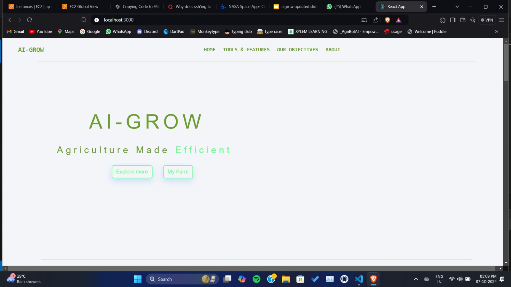
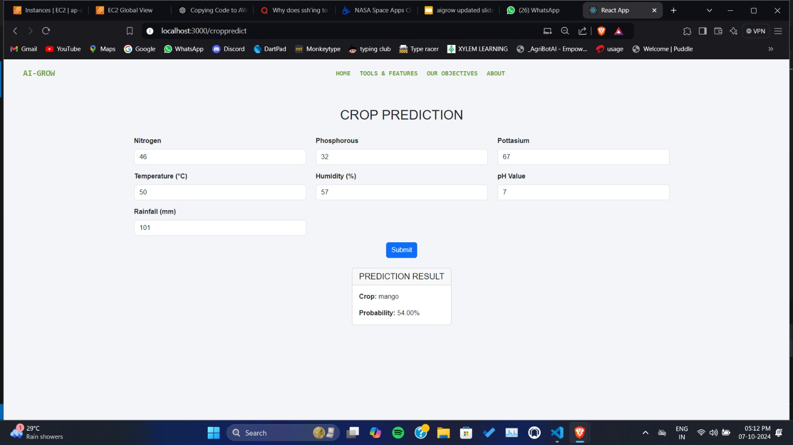
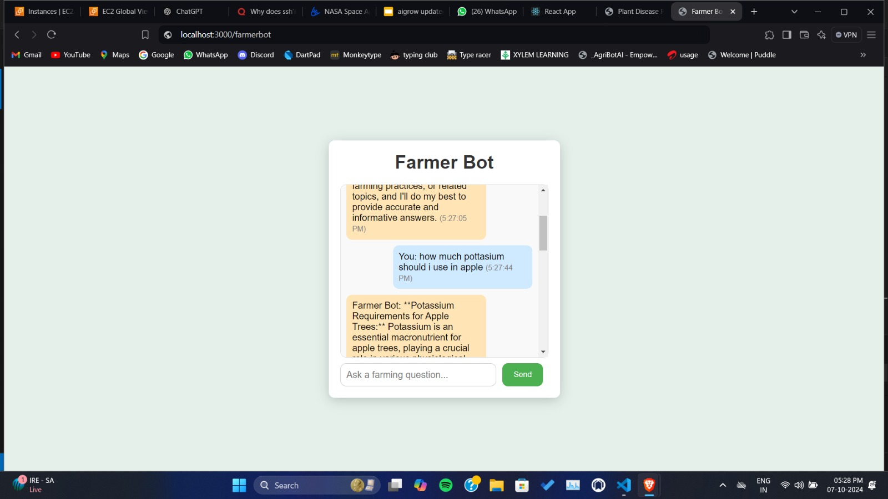
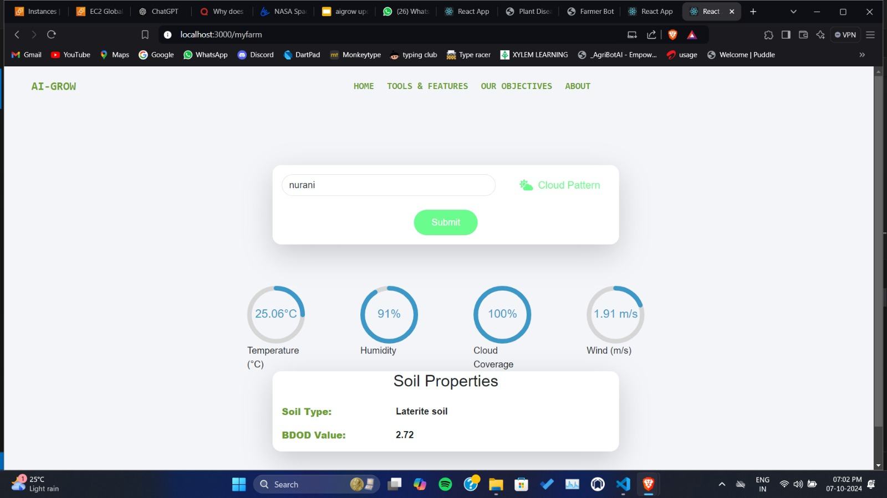

# AI Grow

## Description
AI Grow is an agriculture assistance platform developed for the **NASA Space Apps Challenge 2024**. Our solution uses Earth Observation (EO) data, machine learning, and real-time weather data to provide farmers with crop recommendations, plant disease detection, chatbot assistance and farm monitoring system. It aims to help farmers make data-driven decisions to improve productivity and sustainability.

*Screenshot showing home page.*

*Screenshot showing the crop recommendation feature.*

## Table of Contents
- [Features](#features)
- [Project Links](#project-links)
- [Team](#team)
- [Hackathon Details](#hackathon-details)
- [Acknowledgments](#acknowledgments)
  
## Features
Our AI-Grow web app offers the following features:

1. **Crop Recommendation**: Users can input several critical parameters of their farm, including nitrogen, potassium, and phosphorus content, temperature, humidity, pH level, and the amount of rainfall. Based on this comprehensive data, the system analyzes these inputs to recommend the most suitable type of crop for cultivation on that land. Additionally, the feature provides a probability score indicating the likelihood of successful crop growth, allowing farmers to make informed decisions about their planting choices.

*Screenshot showing the crop recommendation feature.*

2. **Plant Disease Detection**: This feature enables users to upload images of their crops to identify potential diseases. The system employs advanced machine learning algorithms trained on a diverse dataset of plant diseases. By analyzing the uploaded images, it detects signs  disease in the plants.

*Screenshot showing plant disease detection results.*

3. **Chatbot**: The Farmer Bot is an AI-driven chatbot designed to assist users with agriculture-related inquiries and provide guidance on various farming topics. Fine-tuned specifically for agriculture, this model can answer questions about crop management, soil health, pest control, irrigation practices, and more.

*Screenshot showing chatbot assistant.*

4. **Farm Monitoring**: The Farm Monitoring System provides comprehensive insights into the environmental and soil conditions of a farm by taking its location as input. It leverages real-time and historical data to empower farmers with essential information, including cloud patterns and coverage for understanding sunlight availability, rainfall amounts for effective irrigation planning, and real-time temperature and humidity levels critical for optimizing crop growth. Additionally, the system analyzes soil characteristics such as soil type, affecting water retention and nutrient availability, as well as bulk density (BDOD), which offers insights into soil compaction and porosity. This detailed monitoring equips farmers with valuable data to enhance their agricultural management strategies effectively.

*Screenshot showing farm monitoring.*

## Project Links
- **Project Presentation**: [Link to PPT](https://example.com/presentation)
- **Demo Video**: [Link to Demo](https://example.com/demo-video)

## Team
This project was created by **Team Yukti** for the NASA Space Apps Challenge 2024.

### Team Members:
- **Jovin**:[github](https://github.com/tecrade)
- **Nirmal**:[github](https://github.com/sutar-stack)
- **Riswan**:[github](https://github.com/rixprog)
- **Surya**:[github]()

## Hackathon Details
AI Grow was developed as part of the **NASA Space Apps Challenge 2024**. The challenge encouraged teams to solve real-world problems using space-based data and technology.

- **Hackathon**: NASA Space Apps Challenge 2024
- **Project Goal**: Leveraging earth observation data for informed agricultural decision making.
- **Year**:2024

## Acknowledgments
- We would like to thank NASA and the organizers of the NASA Space Apps Challenge for the opportunity to participate in this event and made such innovative solution for agriculture sector all over the world.

